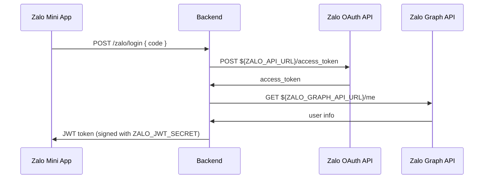

# 🔧 Zalo Environment Variables Documentation

## 📋 **Environment Variables trong `.env`:**

```properties
# Zalo Mini App Configuration
ZALO_APP_ID=2615059320225385531
ZALO_APP_SECRET=owU7t2KEnK11xCm1xJBE
ZALO_JWT_SECRET=MyZaloMiniApp2024_SuperSecretKey_AbC123XyZ134_VeryLongAndSecure

# Zalo API URLs
ZALO_API_URL=https://oauth.zaloapp.com/v4
ZALO_GRAPH_API_URL=https://graph.zalo.me/v2.0
```

## 🎯 **Mục đích sử dụng:**

### **1. `ZALO_APP_ID` & `ZALO_APP_SECRET`**
- **Sử dụng trong:** `zalo.service.ts`
- **Mục đích:** Xác thực với Zalo OAuth API
- **Dùng để:** Đổi authorization code thành access token

### **2. `ZALO_JWT_SECRET`**  
- **Sử dụng trong:** `zalo-jwt.strategy.ts`
- **Mục đích:** Ký và verify JWT token cho hệ thống
- **Dùng để:** Bảo mật JWT token của mobile app

### **3. `ZALO_API_URL`**
- **Sử dụng trong:** `zalo.service.ts` 
- **Mục đích:** OAuth endpoint để đổi code → access token
- **URL:** `https://oauth.zaloapp.com/v4`
- **Endpoint sử dụng:** `/access_token`

### **4. `ZALO_GRAPH_API_URL`**
- **Sử dụng trong:** `zalo.service.ts`
- **Mục đích:** Graph API để lấy thông tin user
- **URL:** `https://graph.zalo.me/v2.0` 
- **Endpoint sử dụng:** `/me`

## 🔄 **Flow sử dụng:**



## 📝 **Code Implementation:**

### **zalo.service.ts:**
```typescript
constructor(configService: ConfigService) {
  this.zaloAppId = configService.get<string>('ZALO_APP_ID');
  this.zaloAppSecret = configService.get<string>('ZALO_APP_SECRET');
  this.zaloOAuthUrl = configService.get<string>('ZALO_API_URL');
  this.zaloGraphApiUrl = configService.get<string>('ZALO_GRAPH_API_URL');
}

// Đổi code → access token
await axios.post(`${this.zaloOAuthUrl}/access_token`, { ... });

// Lấy user info
await axios.get(`${this.zaloGraphApiUrl}/me`, { ... });
```

### **zalo-jwt.strategy.ts:**
```typescript
constructor(configService: ConfigService) {
  super({
    secretOrKey: configService.get<string>('ZALO_JWT_SECRET'),
  });
}
```

## ✅ **Đã được sử dụng:**
- ✅ `ZALO_APP_ID` - OAuth authentication
- ✅ `ZALO_APP_SECRET` - OAuth authentication  
- ✅ `ZALO_JWT_SECRET` - JWT token signing
- ✅ `ZALO_API_URL` - OAuth endpoint
- ✅ `ZALO_GRAPH_API_URL` - Graph API endpoint

## 🔍 **Troubleshooting:**

Nếu gặp lỗi "token không hợp lệ":

1. **Kiểm tra config load đúng:**
   ```bash
   GET /zalo/debug-config
   ```

2. **Kiểm tra console logs:** Server sẽ hiển thị:
   ```
   Zalo Config: {
     appId: "26150...",
     appSecret: "owU7t...", 
     oauthUrl: "https://oauth.zaloapp.com/v4",
     graphApiUrl: "https://graph.zalo.me/v2.0"
   }
   ```

3. **Test API endpoints:**
   - OAuth: `https://oauth.zaloapp.com/v4/access_token`
   - Graph: `https://graph.zalo.me/v2.0/me`
